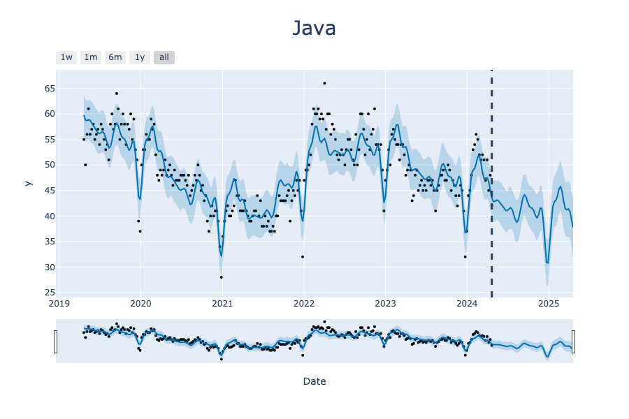

# ProgrammingLanguageTrends

Exploratory analysis using [Kaggle dataset](https://www.kaggle.com/datasets/nextmillionaire/programming-languages-trend-over-time/code) on programming languages.

Primary forecasting model is [Prophet](https://facebook.github.io/prophet/docs/quick_start.html).

## Folder Structure
- data
  - [archive.zip](./data/archive.zip) (zipped data which should be extracted and renamed to data.csv in the data folder)
  - data.csv 
    - Week: Object type with date data in month/day/year format
    - Python/Java/C++: Cols with search count of that language for each week
- environment
  - [environment.yml](./environment/environment.yml): list of all required packages
- imgs
  - Location for images generated to be stored
  - img paths are used in this readme, so moving or renaming them may break links
- notebooks
  - [InitialEDA.ipynb](./notebooks/InitialEDA.ipynb): data investigation and summary statistics
  - [ProphetModels.ipynb](./notebooks/ProphetModels.ipynb): primary analysis
    
## Data Summary

Data summary generated by [Skimpy](https://pypi.org/project/skimpy/) package.

## Forecast

For Python, Java, and C++ training data of counts of internet searches were used to predict future trends with Prophet. Counts were collected weekly from 2019-04-21 to 2024-04-21. Forecasts are projected weekly for the following year (52 predictions).

For each graph, a vertical dashed line indicates the end of existing data and the transition to predictions. 

NOTE: The bottom bar is a slider which can be used in interactive plots to zoom in on a subsection of the data. 

### Python

### Java

### C++

