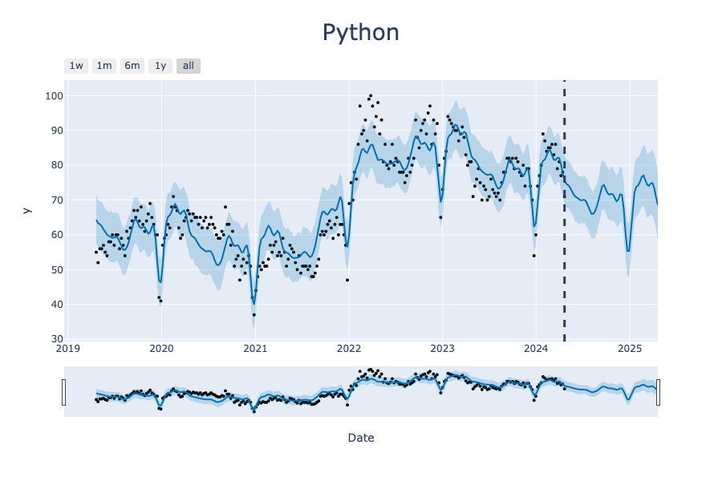

# ProgrammingLanguageTrends
 Exploratory analysis of Kaggle dataset on programming languages.

Original data found at: https://www.kaggle.com/datasets/nextmillionaire/programming-languages-trend-over-time/code

Primary analysis uses [Prophet](https://facebook.github.io/prophet/docs/quick_start.html) model for forecasting.

## Folder Structure
- data
  - archive.zip (contains zipped csv of data which should be renamed to data.csv in the data folder)
  - data.csv 
    - Week: Object type with date data in month/day/year format
    - Python/Java/C++: Cols with search count of that language for each week
- environment
  - conda.yml file contains list of all required packages for this repo
- imgs
  - folder with images created throughout analysis
  - img paths are used in this readme, so moving or renaming them may break links
- notebooks
  - InitialEDA.ipynb
    - ingest data
    - skimpy analysis
    - basic summary descriptive stats
  - PropheModels.ipynb 
    - forecast data to predict next time points
    - visualize data and trends
- LICENSE
  - MIT license for usage
- README.md
  - This file with project details, results, and summary information
    
## Data Summary

Data summary generated by [Skimpy](https://pypi.org/project/skimpy/) package.

## Forecast

For Python, Java, and C++ training data of counts of internet searches were used to predict future trends with Prophet. Counts were collected weekly from 2019-04-21 to 2024-04-21. Forecasts are projected weekly for the following year (52 predictions).

For each graph, a vertical dashed line indicates the end of existing data and the transition to predictions. 

NOTE: The bottom bar is a slider which can be used in interactive plots to zoom in on a subsection of the data. 

### Python

### Java

### C++

